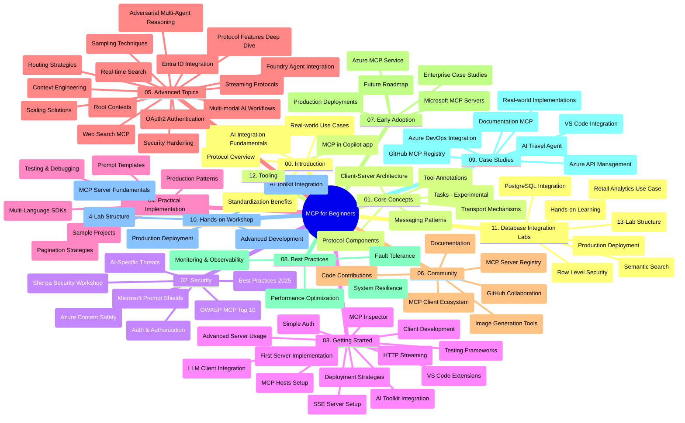

# 初學者的模型上下文協議（MCP）學習指南

本學習指南提供「初學者的模型上下文協議（MCP）」課程的資料庫架構與內容概覽。請使用本指南有效率地瀏覽資料庫，充分利用可用資源。

## 資料庫概覽

模型上下文協議（MCP）是一個用於 AI 模型與客戶端應用程式之間交互的標準化框架。MCP 最初由 Anthropic 創建，現由官方 GitHub 組織中的更廣泛 MCP 社群維護。本資料庫提供完整課程內容，包含 C#、Java、JavaScript、Python 及 TypeScript 的實作範例，專為 AI 開發者、系統架構師和軟體工程師設計。

## 視覺化課程地圖

## 資料庫結構

資料庫分為十二個主要章節，各專注於 MCP 的不同面向：

1. **介紹（00-Introduction/）**
   - 模型上下文協議概述
   - AI 工作流程中標準化的重要性
   - 實際應用案例與效益

2. **核心概念（01-CoreConcepts/）**
   - 客戶端-伺服器架構
   - 主要協議元件
   - MCP 中的訊息模式
   - 目前規範：[MCP 變更內容：2026-07-28 規範](./01-CoreConcepts/mcp-2026-07-28.md) — 無狀態協議核心、擴充框架，以及 Roots/Sampling/Logging 的棄用

3. **安全性（02-Security/）**
   - MCP 系統中的安全威脅
   - 安全實作最佳做法
   - 認證與授權策略
   - 實作示範 [CIMD 和 DCR 授權範例](./02-Security/samples/cimd-dcr-auth/README.md)
   - <strong>完整安全文件</strong>：
     - MCP 安全最佳實務
     - Azure 內容安全實作指南
     - MCP 安全控制與技術
     - MCP 最佳實務速查表
   - <strong>重要安全議題</strong>：
     - 提示注入和工具中毒攻擊
     - 會話劫持及混淆代理問題
     - 權杖直通漏洞
     - 過度權限與存取控制
     - AI 元件供應鏈安全
     - 微軟提示防護器整合

4. **入門指南（03-GettingStarted/）**
   - 環境設置與配置
   - 建立基礎 MCP 伺服器與客戶端
   - 與現有應用整合
   - 包含章節：
     - 第一個伺服器實作
     - 客戶端開發
     - 大型語言模型客戶端整合
     - VS Code 整合
     - 伺服器傳送事件（SSE）伺服器
     - 進階伺服器用法
     - HTTP 串流
     - AI 工具包整合
     - 測試策略
     - 部署指南

5. **實務開發（04-PracticalImplementation/）**
   - 使用不同語言的 SDK
   - 除錯、測試與驗證技巧
   - 設計可重用提示範本及工作流程
   - 各類實作範例專案

6. **進階主題（05-AdvancedTopics/）**
   - 上下文工程技術
   - Foundry 代理整合
   - 多模態 AI 工作流程
   - OAuth2 身份驗證示範
   - 即時搜尋功能
   - 即時串流
   - 根上下文實作
   - 路由策略
   - 取樣技術
   - 擴展方法
   - 安全性考量
   - Entra ID 安全整合
   - 網路搜尋整合
   - 對抗式多代理推理（辯論模式）

7. **社群貢獻（06-CommunityContributions/）**
   - 如何貢獻程式碼及文檔
   - 透過 GitHub 協作
   - 社群驅動的增強與回饋
   - 使用各種 MCP 客戶端（Claude 桌面版、Cline、VSCode）
   - 操作熱門 MCP 伺服器，包括圖片生成

8. **早期採用經驗（07-LessonsfromEarlyAdoption/）**
   - 實務案例與成功故事
   - 架構與部署 MCP 解決方案
   - 趨勢與未來路線圖
   - **微軟 MCP 伺服器指南**：涵蓋 10 種生產準備的微軟 MCP 伺服器：
     - Microsoft Learn Docs MCP 伺服器
     - Azure MCP 伺服器（15+ 專用連接器）
     - GitHub MCP 伺服器
     - Azure DevOps MCP 伺服器
     - MarkItDown MCP 伺服器
     - SQL Server MCP 伺服器
     - Playwright MCP 伺服器
     - Dev Box MCP 伺服器
     - Microsoft Foundry MCP 伺服器
     - Microsoft 365 Agents Toolkit MCP 伺服器

9. **最佳實務（08-BestPractices/）**
   - 效能調校與優化
   - 設計容錯的 MCP 系統
   - 測試與韌性策略

10. **案例研究（09-CaseStudy/）**
    - <strong>七個全面的案例研究</strong>展示 MCP 在各種場景的多樣彈性：
    - **Azure AI 旅遊代理**：多代理協調 Azure OpenAI 與 AI 搜尋
    - **Azure DevOps 整合**：藉由 YouTube 資料更新自動化工作流程
    - <strong>即時文件擷取</strong>：Python 控制台客戶端搭配串流 HTTP
    - <strong>互動式學習計劃產生器</strong>：Chainlit 網路應用結合對話式 AI
    - <strong>編輯器內文件</strong>：VS Code 整合 GitHub Copilot 工作流程
    - **Azure API 管理**：企業級 API 整合及 MCP 伺服器建立
    - **GitHub MCP 註冊表**：生態系開發與代理整合平台
    - 涵蓋企業整合、開發者生產力及生態系建設的實例範例

11. **實作工作坊（10-StreamliningAIWorkflowsBuildingAnMCPServerWithAIToolkit/）**
    - MCP 與 AI 工具包深度實作工作坊
    - 建立智慧應用，連結 AI 模型與真實世界工具
    - 實務模組涵蓋基礎、客製伺服器開發及生產部署策略
    - <strong>實驗室結構</strong>：
      - 實驗室 1：MCP 伺服器基礎
      - 實驗室 2：進階 MCP 伺服器開發
      - 實驗室 3：AI 工具包整合
      - 實驗室 4：生產部署與擴展
    - 以實驗室為基礎的分步教學

12. **MCP 伺服器資料庫整合實驗室（11-MCPServerHandsOnLabs/）**
    - **完整的 13 個實驗室學習路徑**，搭配 PostgreSQL 打造生產等級 MCP 伺服器
    - <strong>經典零售分析案例實作</strong>，採用 Zava Retail 使用案例
    - <strong>企業級模式</strong>，含列級安全（RLS）、語意搜尋及多租戶資料存取
    - <strong>完整實驗室結構</strong>：
      - **實驗室 00-03：基礎** — 介紹、架構、安全性、環境設定
      - **實驗室 04-06：建置 MCP 伺服器** — 資料庫設計、MCP 伺服器實作、工具開發

      - **實驗室 07-09：進階功能** - 語意搜尋、測試與除錯、VS Code 整合
      - **實驗室 10-12：生產環境與最佳實踐** - 部署、監控、優化
    - <strong>涵蓋技術</strong>：FastMCP 框架、PostgreSQL、Azure OpenAI、Azure Container Apps、Application Insights
    - <strong>學習成果</strong>：具備生產環境標準的 MCP 伺服器、資料庫整合模式、AI 驅動的分析、企業級安全性

13. **工具鏈 (12-tooling/)**
    - 學習如何在 Copilot 應用程式及其他工具中使用 MCP

## 補充資源

此資源庫包含支援資源：

- <strong>圖片資料夾</strong>：包含課程中使用的圖表與插圖
- <strong>翻譯版本</strong>：多語言支援，並提供文件的自動翻譯
- **官方 MCP 資源**：
  - [MCP 文件](https://modelcontextprotocol.io/)
  - [MCP 規範](https://modelcontextprotocol.io/specification/2026-07-28/)
  - [MCP GitHub 倉庫](https://github.com/modelcontextprotocol)

## 如何使用此資源庫

1. <strong>依序學習</strong>：依照章節順序（00 至 11）進行，有系統地學習。
2. <strong>語言特定焦點</strong>：若對特定程式語言有興趣，可探索 samples 目錄中該語言的實作。
3. <strong>實務操作</strong>：從「快速上手」部分開始，設定開發環境並建立首個 MCP 伺服器與客戶端。
4. <strong>深入探索</strong>：對基礎內容掌握後，進入進階議題以擴展知識。
5. <strong>社群互動</strong>：透過 GitHub 論壇與 Discord 頻道加入 MCP 社群，與專家及其他開發者交流。

## MCP 客戶端與工具

本課程涵蓋各種 MCP 客戶端與工具：

1. <strong>官方客戶端</strong>：
   - Visual Studio Code 
   - Visual Studio Code 中的 MCP
   - Claude 桌面版
   - VSCode 中的 Claude
   - Claude API

2. <strong>社群客戶端</strong>：
   - Cline（終端機版）
   - Cursor（程式碼編輯器）
   - ChatMCP
   - Windsurf

3. **MCP 管理工具**：
   - MCP CLI
   - MCP Manager
   - MCP Linker
   - MCP Router

## 熱門 MCP 伺服器

此資源庫介紹多款 MCP 伺服器，包括：

1. **官方 Microsoft MCP 伺服器**：
   - Microsoft Learn Docs MCP 伺服器
   - Azure MCP 伺服器（15+ 專用連接器）
   - GitHub MCP 伺服器
   - Azure DevOps MCP 伺服器
   - MarkItDown MCP 伺服器
   - SQL Server MCP 伺服器
   - Playwright MCP 伺服器
   - Dev Box MCP 伺服器
   - Microsoft Foundry MCP 伺服器
   - Microsoft 365 Agents Toolkit MCP 伺服器

2. <strong>官方參考伺服器</strong>：
   - 檔案系統
   - 抓取
   - 記憶體
   - 連續思考

3. <strong>影像生成</strong>：
   - Azure OpenAI DALL-E 3
   - Stable Diffusion WebUI
   - Replicate

4. <strong>開發工具</strong>：
   - Git MCP
   - 終端控制
   - 程式碼助理

5. <strong>專用伺服器</strong>：
   - Salesforce
   - Microsoft Teams
   - Jira 與 Confluence

## 貢獻

本存儲庫歡迎社群的貢獻。請參閱「社群貢獻」部分，以獲得有關如何有效參與 MCP 生態系統的指導。

----

*本學習指南最後更新於 2026 年 9 月 9 日。它反映了 MCP 規範 `2026-07-28`，即當前的協議版本。一些實作範例仍明確使用版本 `2025-11-25`，而其 SDK 和工具則採用無狀態協議 API。*

---

<!-- CO-OP TRANSLATOR DISCLAIMER START -->
**免責聲明**：
此文件已使用 AI 翻譯服務 [Co-op Translator](https://github.com/Azure/co-op-translator) 進行翻譯。雖然我們努力追求準確性，但請注意自動翻譯可能包含錯誤或不準確之處。原始文件的母語版本應視為權威來源。對於關鍵資訊，建議採用專業人工翻譯。我們不對因使用此翻譯所產生的任何誤解或誤譯承擔責任。
<!-- CO-OP TRANSLATOR DISCLAIMER END -->